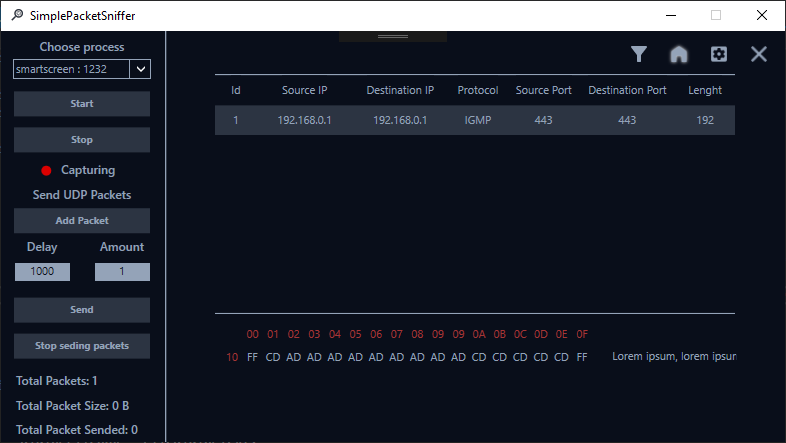

# SimplePacketSniffer

## Introduction
This application was created for people who want to sniff - download packets from the web quickly and simply. 
The application uses a GUI interface, which makes it easy to use and intuitive to browse through a large number of packages. 
For even clearer operation, a sorting function and filtering by multiple criteria have been added, making it easy for anyone to use. 

## Example presentation

## Features
* Capture any packets
* Copy packet content
* Save captured packets to .txt, .js
* Capture limitations by amount, time, memory
* Listing through all packets
* Sorting and filtering by many criteria

## Inspiration 
The application is inspired by the popular WireShark programme, but in a clearer and simpler version. 
I have also added a few interesting features from myself.

## Other information
The overlay sketches of the application were made up by me, but I gave them to my good friend to embellish in the program , "figma". As always, he didn't let me down and designed this beautiful interface which I hand-wrote into xaml. I would like to thank him very much for his help, without him this application could not have looked so good.

  
